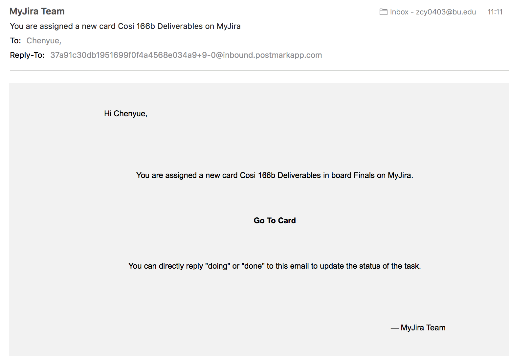
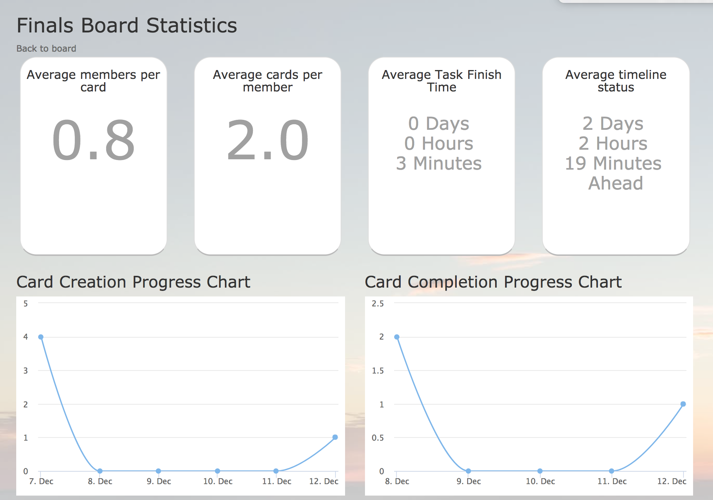
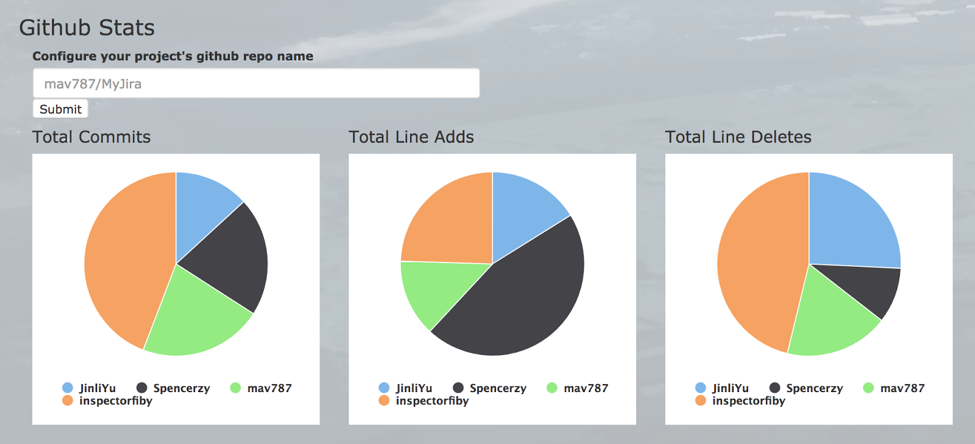
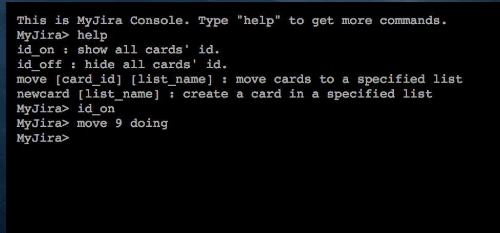

# Welcome to MyJira

**My Jira is a clear-to-read and easy-to-update team project tracking tool built with Ruby on Rails as an online version of Kanban board.**

## Why did we make MyJira?

* College students working on team projects don’t often have time to meet and discuss what the work progress is like with each team member.
* It’s also hard to keep track of unfinished tasks in the order of urgency/dependency, and divide them among the members evenly.
* There’s no fast and clear way to measure how much contribution each member has made to the team project.
* The current products are independent platforms that need spending extra time and work maintaining.

## How does MyJira work?
### See all the projects you're a part of on your main page

### Get to know the real time progress on each project's index page

### View and edit all details of a card on the card detail popup

### Get notified about any new activities involving you when you're online...

### and offline!

### Know your project's progress and stats at a glance

### Including the github activities

### Finally, satisfy your inner keyboard-over-mouse geek soul!

## How did we make MyJira?

* Action Cable

We provide every team board with a unique channel, which allows team members to receive information update automatically as long as they opened the board page and subscribed the channel. 

* JQuery Draggable Widget

We made our cards draggable using JQuery draggable widget. We bind the dragging events with recall functions, which can be used to make HTTP request with ajax and update the position of card.

* Rails ActionMailer

We used the ActionMailer class in Rails to implement the feature of sending emails to users. By setting up different mailer models and views for each model, we accomplished the feature of sending different emails to users when triggered by different events.

* Postmark Inbound Email Server

We used the inbound webhook feature of Postmark app. By configuring the inbound webhook address to the route to our application’s email processor class, every time when an email sent to the email address id Postmark has given us, the email will be converted to JSON data and be posted to our server.

* Griddler Email Parsing

Griddler is a Rails engine that provides an endpoint for services that convert incoming emails to HTTP POST requests. It parses these POSTs and hands off a built email object to an email processor model class that we created.

* Chartkick Smart Chart Generator

Chartkick is a Ruby gem that helps generate Javascript charts with only one line of Ruby code. It helped us present clear and precise statistics visualization to our users about their projects.

* Github Statistics API

Github 's statistics API returns JSON data containing each contributor’s activity broken down to the commit number, added lines and deleted lines by week. We use this API to offer a visualization of a project’s github contributions.

* Github Webhook

Github also provides the webhook function that can be triggered by different repository events. We made use of it by linking the commit message text with possibly a card in the doing list of a project, and updating the card status when appropriate.

* Google Login

Google provides some APIs that allow users to get authorized through their Google account. We used omniauth-google_oauth2 gem which will automatically send request and fetch the data. With our database to persist the data, we made it possible for users to sign in conveniently with their google-related accounts.

* JQuery Terminal Emulator

jQuery Terminal Emulator is a plugin that provides the interpreter parsing users’ inputs and automatically calling JSON-RPC service. In our application, every time the user types in commands like “move cards”, the terminal will send AJAX requests and the server will respond and push changes to every client by Action Cable.  

